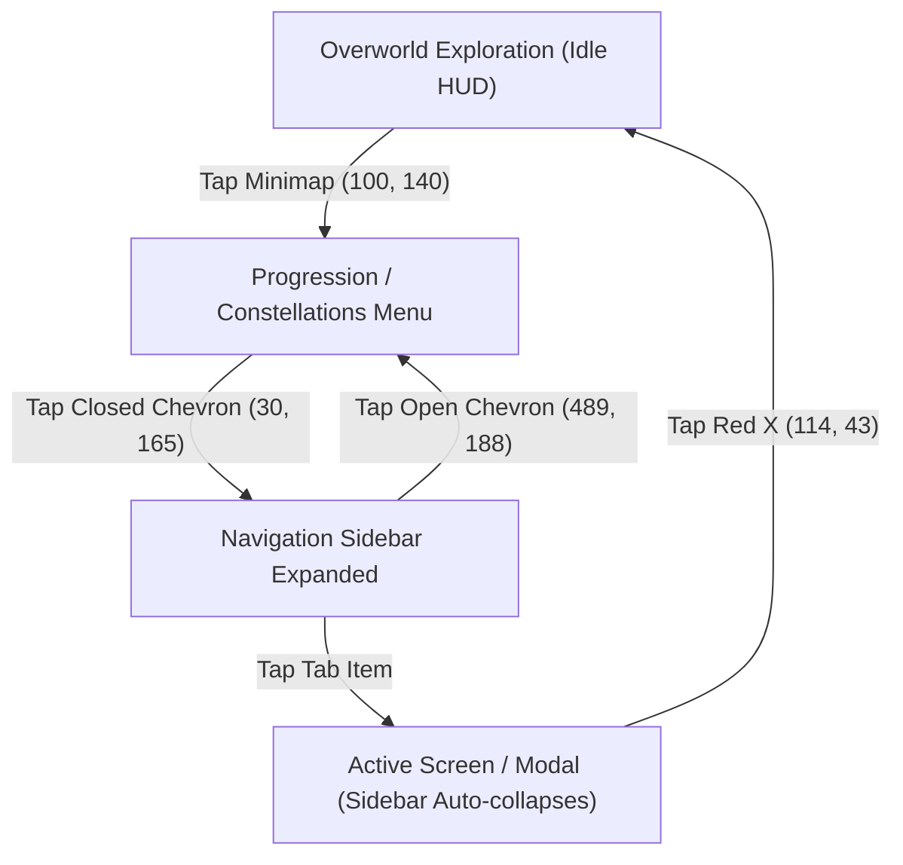

# Revomon: Novus — HUD & Interface State Machine

Calibrated coordinate layout and state machine transitions for ***Revomon: Novus*** on Samsung Galaxy S24 Ultra ($2340 \times 1080$ landscape).

---

## 1. Key Overworld HUD Anchors

| Element | Normalized Anchor $(r_x, r_y)$ | Reference Pixels ($2340 \times 1080$) | Function / Description |
| :--- | :--- | :--- | :--- |
| **Minimap Compass** | $(0.043, 0.130)$ | $(100, 140)$ | Tap opens Progression / Player Menu. Center of compass circle is at $(154, 161)$. |
| **Minimap Radar Dots** | Variable | Top-Left Compass | Light green dots on the compass radar represent roaming wild Revomon. |
| **Action Interact Button** | $(0.930, 0.835)$ | $(2177, 902)$ | Circular action button on the bottom right to interact or expand actions. |
| **Chat Bubble** | $(0.032, 0.381)$ | $(75, 412)$ | Opens overworld chat box. |
| **Gem Store Modal** | $(0.932, 0.127)$ | $(2182, 137)$ | In-game Gem Store modal ("Buy Gems" & "Spend Gems"). |
| **Battle Pass / Ticket** | $(0.879, 0.127)$ | $(2058, 137)$ | Free Pass / Gold Pass tier tracks modal. |
| **Virtual Movement Pad** | $(0.120, 0.650)$ | $(280, 702)$ | Virtual joystick zone on Touch Slot 0. Radius $150\text{ px}$. |
| **Camera Touch Surface** | $(0.750, 0.500)$ | $(1755, 540)$ | Right hemisphere of display on Touch Slot 1. Swipes adjust yaw and pitch. |

---

## 2. 100% Menu & Sidebar Hierarchy

### 2.1 Navigation Sidebar Tabs (Unscrolled)
* **Progression**: `(180, 170)` — Constellation Guardian skill trees.
* **Map**: `(180, 320)` — World map overview (disabled in Alpha).
* **Market**: `(180, 510)` — Global Marketplace (Revomon, Items, My Listings).
* **Avatar / Wardrobe**: `(180, 700)` — Character customizer with 5 equipped equipment slots and `< HEAD >` catalog.
* **Clan**: `(180, 850)` — Clan member roster, online status, and permissions.
* **Friends List**: `(180, 1030)` — Two-column friend entries with Overworld status and removal buttons.

### 2.2 Scrolled Sidebar Tabs
Executing `drag(180, 950 -> 180, 200)` reveals lower items:
* **PVP Queue**: `(180, 410)` — Matchmaking queue modal with animated spinner.
* **Settings**: `(180, 580)` — Audio, Graphics, Overworld Distance, and Waypoint Reset.
* **Quit Game**: `(180, 680)` — Exits game instance.

### 2.3 Automated Waypoint / Position Reset Sequence
Teleports the player back to the Wooden Pier spawn point benchmark:
1. Tap Minimap Compass `(100, 140)` $\rightarrow$ opens Progression.
2. Tap Chevron `(30, 165)` $\rightarrow$ expands sidebar.
3. Drag sidebar up `(180, 950) -> (180, 200)` $\rightarrow$ reveals Settings.
4. Tap Settings `(180, 580)` $\rightarrow$ opens Settings modal.
5. Tap `"I'm stuck! reset my position"` at `(1773, 813)` (bounding box `[1553..1993, 776..850]`).
6. Tap Red X `(114, 43)` $\rightarrow$ returns to Overworld. Wait $3.0\text{ s}$ for teleport animation.

---

## 3. Combat Stadium Overlay Anchors

During turn-based battles (indicated by static `VS` insignia at `[1115, 5]`, size `110 x 45`):

| Action Element | Hitbox Center ($2340 \times 1080$) | Bounding Box | Function |
| :--- | :--- | :--- | :--- |
| **Attacks Button** | $(1160, 985)$ | `[1050, 930] (220 x 110)` | Expands move selection card bar. |
| **Move Card Slot 1** | $(575, 930)$ | `[380, 880] (390 x 100)` | Executes move 1. |
| **Move Card Slot 2** | $(965, 930)$ | `[770, 880] (390 x 100)` | Executes move 2. |
| **Move Card Slot 3** | $(1360, 930)$ | `[1165, 880] (390 x 100)` | Executes move 3. |
| **Move Card Slot 4** | $(1755, 930)$ | `[1560, 880] (390 x 100)` | Executes move 4. |
| **Green Capsule** | $(2275, 390)$ | `[2220, 335] (110 x 110)` | Throws standard capture capsule at wild Revomon. |
| **Red Capsule** | $(2275, 520)$ | `[2220, 465] (110 x 110)` | Throws premium capture capsule at wild Revomon. |
| **Run Button** | $(180, 985)$ | `[70, 930] (220 x 110)` | Flees wild battle. |
| **Team Button** | $(1400, 985)$ | `[1290, 930] (220 x 110)` | Opens party switcher modal. |
| **Send to Battle** | $(1165, 85)$ | `[1055, 40] (220 x 90)` | Confirms selected party member swap. |
| **Victory Close X** | $(1935, 75)$ | `[1885, 25] (100 x 100)` | Dismisses post-battle XP/loot modal. |

*Note: In Novus, players can move around freely during battles using the virtual joystick on Slot 0. Turns have a strict **60-second** timeout.*

See also: [Locomotion Guide](./locomotion.md) and [Combat & Slingshot](./combat_slingshot.md).
