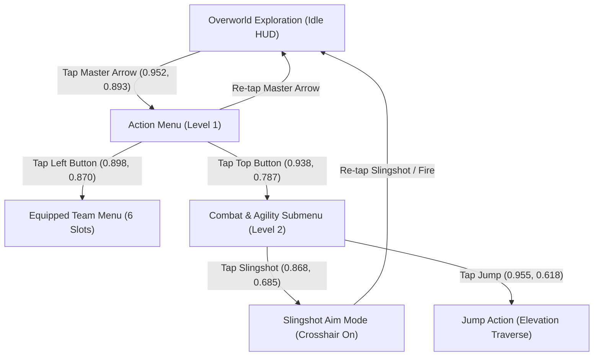

# Revomon: Novus — HUD & Interface State Machine

The interface layout in ***Revomon: Novus*** follows a normalized coordinate layout designed for fixed landscape orientation.

---

## 1. Key HUD Anchors

| Element | Normalized Anchor $(r_x, r_y)$ | Reference Pixels ($2340 \times 1080$) | Function / Description |
| :--- | :--- | :--- | :--- |
| **Minimap Radar** | $(0.075, 0.130)$ | $(175, 140)$ | Compass with Cardinal points (N, S, E, W), blue player beacon, and yellow entity blips. |
| **Location & Level** | $(0.200, 0.150)$ | $(468, 162)$ | Displays current region (e.g. `Glimmerhaven city - level 10 -`) and player tamer name. |
| **Chat Bubble** | $(0.033, 0.280)$ | $(77, 302)$ | Opens local / global multi-player communication box. |
| **Virtual Movement Pad** | $(0.120, 0.650)$ | $(280, 702)$ | Floating left joystick zone. Touch-down activates omnidirectional movement. |
| **Camera Touch Surface** | $(0.550, 0.500)$ | $(1287, 540)$ | Full right hemisphere of display. Swipes adjust yaw and pitch. |
| **Action Menu Master Arrow**| $(0.952, 0.893)$ | $(2227, 964)$ | Circular dark badge with white arrow. Expands Menu Level 1. |
| **Shop & Inventory** | $(0.885, 0.090)$ | $(2070, 97)$ | Market stall and inventory pass icons. |

---

## 2. Control Hierarchy & Menu State Machine

The action controls follow a nested multi-level tree structure:

### 2.1 Action Menu Level 1
Tapping the Master Arrow `(0.952, 0.893)` reveals two primary sub-buttons:
1. **Left Button** `(0.898, 0.870)` `[2101, 940]`: Opens the Equipped Team Menu (displays 6 active Revomon slots).
2. **Top Button** `(0.938, 0.787)` `[2195, 850]`: Expands Action Menu Level 2.

### 2.2 Action Menu Level 2
Expands into combat and agility controls:
1. **Slingshot / Aim Button** `(0.868, 0.685)` `[2031, 740]`: Toggles Slingshot Aim Mode.
2. **Jump Button** `(0.955, 0.618)` `[2235, 667]`: Triggers jump physics for hopping over rocks or scaling slopes.

### 2.3 Player Menu Overlay
Tapping the minimap radar `(175, 140)` opens the **Player Menu** overlay:
* Left sidebar: `Progress`, `Map`, `Market`, `Avatar`, `Clan`.
* `Map` row (`≈120, 350`): Opens fullscreen Novus island map (suppresses server AFK timer).
* Close button: Red X at `(0.021, 0.028)` `[50, 30]`.

See also: [Locomotion Guide](./locomotion.md) and [Combat & Slingshot](./combat_slingshot.md).
