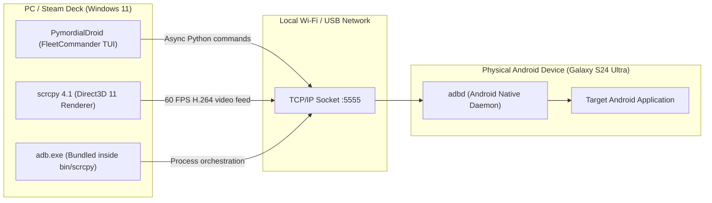
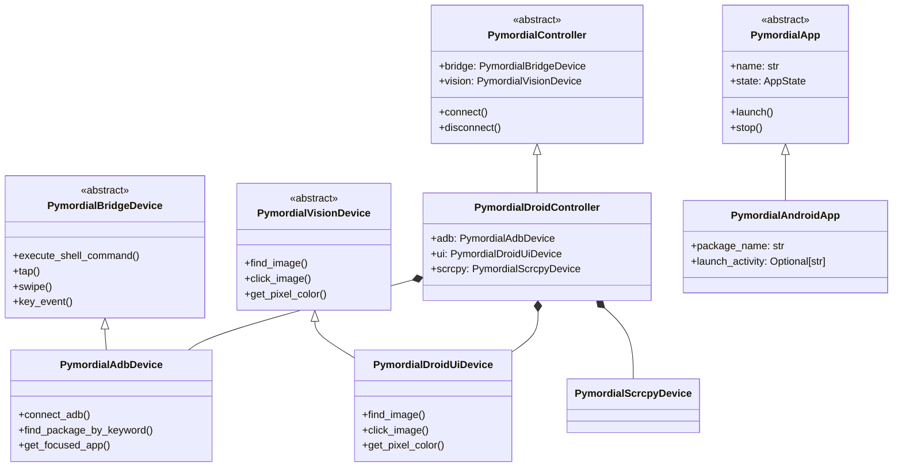

# PymordialDroid — Automation Architecture & System Overview

> [!NOTE]
> This guide documents the host-side infrastructure, wireless ADB networking, process orchestration, and Pymordial contract implementation. For configuration files and layouts, see [Configuration Reference](./configuration.md). For video streaming, see [Display Streaming](./display_streaming.md). For low-level input, see [Touch Injection](./touch_injection.md). For recorded fieldwork gaps, see [Issues Tracker](./issues.md).

---

## 1. Automation Architecture



---

## 2. Bundled Binaries & Path Resolution

The automation suite bundles `scrcpy` and `adb` inside `src/pymordialdroid/bin/scrcpy/`:

* **ADB Executable**: `src/pymordialdroid/bin/scrcpy/adb.exe` (Version 36.0.0-13206524 / 1.0.41)
* **Scrcpy Executable**: `src/pymordialdroid/bin/scrcpy/scrcpy.exe` (Version 4.1 / SDL 3.4.12)
* **Scrcpy Server**: `src/pymordialdroid/bin/scrcpy/scrcpy-server` (Version 4.1)

Both binaries are dynamically resolved in `FleetCommander.__init__`:
```python
base_dir = Path(__file__).resolve().parent
adb_exe = "adb.exe" if sys.platform == "win32" else "adb"
scrcpy_exe = "scrcpy.exe" if sys.platform == "win32" else "scrcpy"

self.config = SystemConfig(
    adb_bin_path=base_dir / "bin" / "scrcpy" / adb_exe,
    scrcpy_bin_path=base_dir / "bin" / "scrcpy" / scrcpy_exe,
)
```

---

## 3. Wireless ADB Pairing & Persistent Port Configuration

### 3.1 Initial Wireless Pairing (TLS)
On Android 11+, Google uses TLS for the initial Wireless Debugging handshake:
1. From the device's "Pair device with pairing code" menu:
   ```bash
   adb pair <IP>:<PAIRING_PORT> <6_DIGIT_PIN>
   ```
2. Keys are authenticated and persisted in `~/.android/adbkey` and `~/.android/adb_known_hosts.pb`.

### 3.2 Persistent Port 5555 Transition
Dynamic wireless debugging ports change on every reboot or Wi-Fi reconnect, and use `STLS` handshakes which pure-Python `adb_shell` cannot negotiate. To make connections permanent and compatible with all Python drivers:
```bash
adb connect <IP>:<DYNAMIC_PORT>
adb -s <IP>:<DYNAMIC_PORT> tcpip 5555
adb connect <IP>:5555
```
This restarts the Android system ADB daemon on port **5555** with standard RSA token authentication.

---

## 4. TUI & Fleet Management

Run PymordialDroid using `uv`:
```bash
cd /d D:\projects\PymordialDroid
uv run pymordialdroid
```
Or run as a module:
```bash
uv run python -m pymordialdroid
```

### Features Matrix
* **[1] Add Devices**: Performs synchronous USB scans or subnet sweeps to auto-discover phones, run `tcpip 5555`, and extract IP addresses via `ip route`.
* **[2] Launch Viewer(s)**: Spawns `scrcpy.exe` with grid layout positioning, `--no-audio`, and optional `--turn-screen-off` (ghost mode to save battery).
* **[3] Organize Windows**: Uses Win32 API (`user32.MoveWindow`) to auto-tile active viewers across multiple displays.
* **[4] Kill All Viewers**: Gracefully terminates running `scrcpy.exe` processes.
* **[5] Install APK**: Pushes APK updates in parallel across all fleet devices.
* **[6] Device Details**: Inspects real-time battery percentages, response latency, and connection states.
* **[7] Restore Layout**: Reopens scrcpy viewers from saved layout session.

---

## 5. Pymordial Contract Implementation

PymordialDroid implements the core abstract interfaces defined by `Pymordial` (`D:\projects\Pymordial`), providing full interoperability with Pymordial's plugin and app state machine system.



### Core Classes & Roles
1. **`PymordialAdbDevice` (`pymordialdroid.devices.adb_device`)**:
   - Implements `PymordialBridgeDevice`.
   - Supports pure-Python `adb_shell` over wireless port 5555 with automatic RSA key generation (`~/.android/adbkey`), falling back to CLI `adb.exe` if needed.
   - Provides Android package discovery (`find_package_by_keyword`), launch activity resolution (`get_launch_activity`), and focused window detection (`get_focused_app`).
2. **`PymordialDroidUiDevice` (`pymordialdroid.devices.ui_device`)**:
   - Implements `PymordialVisionDevice`.
   - Uses OpenCV template matching (`matchTemplate` with `TM_CCOEFF_NORMED`) for `PymordialImage` queries.
   - Takes screenshots on-demand via ADB bridge (`screencap -p`).
3. **`PymordialScrcpyDevice` (`pymordialdroid.devices.scrcpy_device`)**:
   - Implements `PymordialDisplayDevice`.
   - Manages background and foreground `scrcpy` subprocess instances.
4. **`PymordialDroidController` (`pymordialdroid.droid_controller`)**:
   - Implements `PymordialController`.
   - Dynamically resolves and mounts bridge (`adb`), vision (`ui`), and display (`scrcpy`) devices.
5. **`PymordialAndroidApp` (`pymordialdroid.android_app`)**:
   - Extends `PymordialApp`.
   - Manages app lifecycle (`launch`, `stop`, `restart`, `uninstall`) and state transitions.
