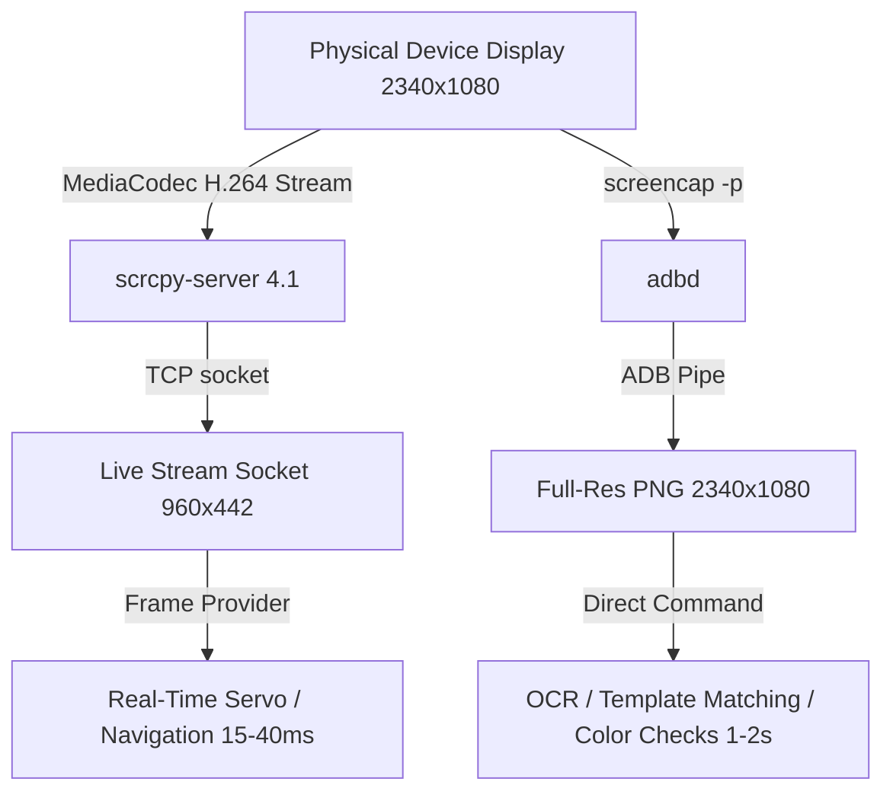

# PymordialDroid — Display Streaming & Perception Pipeline

PymordialDroid relies on `scrcpy` (version 4.1, SDL 3.4.12) to provide ultra-low-latency real-time video streaming, host window embedding, and real-time computer vision frame pipelines.

---

## 1. Streaming Infrastructure & Renderer

* **Renderer Backend**: Direct3D 11 (`d3d11` on Windows) / OpenGL on Linux.
* **Encoding**: Device-side hardware-accelerated H.264 via `MediaCodec`.
* **Framerate & Latency**: Streams typically achieve **44–69 FPS** with an end-to-end frame age of **11–40 ms** over local Wi-Fi / USB.
* **Audio**: Muted by default (`--no-audio`) to preserve host bandwidth and reduce audio buffer overhead.
* **Ghost Mode**: Supports `--turn-screen-off` to stream display frames to the host while keeping the physical AMOLED display unpowered to prevent thermal throttling and save battery.

---

## 2. Real-Time Vision Feed vs. Full-Resolution Screencap

Real-time automation requires balancing perception latency with image resolution:

### 2.1 Live Stream Pipeline (`start_live_stream`)
* Invoked via `controller.start_live_stream(max_size=960, max_fps=30)`.
* Produces frames at **44–69 FPS** with frame ages between **11–40 ms**.
* Ingests into `AndroidController.capture_screen()`, providing sub-100 ms loop latency.
* **Actual Resolution Note**: While requested with `max_size=960`, the actual frame dimensions are **`960x442`** (not `960x440`), because `scrcpy` rounds downscaled dimensions to even integers. Vision code must read `frame.shape[:2]` dynamically.
* **Native Resolution Stream (`max_size=0`)**: When executing OpenCV template matching against assets captured at native device resolution (e.g. $2340 \times 1080$), pass `max_size=0` to preserve physical display resolution without downscale distortion or coordinate drift, while retaining sub-50 ms streaming latency.

### 2.2 Full-Resolution Screencap Pipeline
* Plain `adb shell screencap -p` captures uncompressed PNG frames at native device resolution (**`2340x1080`** on Galaxy S24 Ultra).
* Latency: Costs **1.0–2.0 seconds** per capture.
* Suitable for: Static state detection (title screen, loading bars), OCR text recognition, and pixel-exact template matching.
* Bypass command: `controller.bridge.run_command("screencap -p", decode=False)`.

---

## 3. Coordinate Space Transformation

When processing detections between live feed frames and device touch coordinates:

$$\text{Scale}_X = \frac{W_{\text{device}}}{W_{\text{stream}}} = \frac{2340}{960} = 2.4375$$

$$\text{Scale}_Y = \frac{H_{\text{device}}}{H_{\text{stream}}} = \frac{1080}{442} \approx 2.4434$$

See also: [Touch Injection](./touch_injection.md), [Architecture](./architecture.md), and [Issues](./issues.md).
