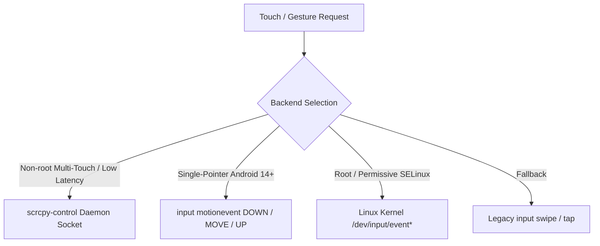

# PymordialDroid — Touch Injection & Multi-Touch Architecture

`PymordialDroid` provides fine-grained, low-latency touch injection via a multi-tiered backend architecture implemented on `AdbDevice` (`devices/adb_device.py`).

---

## 1. Backend Tier Hierarchy



### 1.1 `scrcpy-control` (`ScrcpyControlInjector`, `devices/scrcpy_control.py`)
* **Capabilities**: True concurrent multi-touch (slots 0–9+), $<1\text{ ms}$ packet latency, 60+ Hz stream fidelity, non-root.
* **Mechanism**: Runs a headless `scrcpy-server` instance (`video=false audio=false control=true cleanup=false`) via `app_process` as UID 2000 (`shell`). Sends 32-byte binary `INJECT_TOUCH_EVENT` packets over a local TCP tunnel (`adb forward tcp:<port> localabstract:scrcpy_<scid>`).
* **Binary Packet Format**: Big-endian 32-byte struct:
  `struct.pack('>BBQiiHHHii', 2, action, pointer_id, x, y, width, height, 0xffff, 0, 0)`
  where action: `0=DOWN`, `1=UP`, `2=MOVE`.
* **Server-Side Tracking**: Server's internal `PointersState` automatically synthesizes pointer masks (`ACTION_POINTER_DOWN` / `ACTION_POINTER_UP`), allowing simultaneous two-thumb operation (joystick + camera).
* **Startup Policy**: Lazy initialization on first slot > 0 request or eager start via `start_multitouch()` / `scrcpy_control=True`. Once running, serves all slots.

### 1.2 `motionevent` (`MotionEventInjector`, `devices/motionevent_injector.py`)
* **Capabilities**: Low-cost single-pointer touch hold and fine drags on non-rooted Android 14+.
* **Mechanism**: Executes `adb shell input motionevent <DOWN|MOVE|UP> <x> <y>`.
* **Limitation**: Strictly single-pointer (AOSP `InputShellCommand` hardcodes `pointerCount = 1`, `pointerId = 0`). Requests for slot > 0 log a warning and return False.

### 1.3 `sendevent` (`TouchInjector`, `devices/touch_injector.py`)
* **Capabilities**: Direct Linux kernel multi-touch protocol (type-B slots) via `/dev/input/event*`.
* **Limitation**: Requires root or permissive SELinux; denied by SELinux on retail Samsung hardware (One UI 6.1+).

### 1.4 `input swipe` (Legacy fallback)
* Coarse fallback for basic taps and long-presses when fine touch injection is completely unavailable.

---

## 2. Unified Touch API (`AdbDevice`)

All controller touch interactions flow through unified methods:

```python
# Presses contact down at display pixel coordinates
dev.touch_down(x, y, slot=0)

# Moves active contact to new pixel coordinates
dev.touch_move(x, y, slot=0)

# Lifts contact on the given slot
dev.touch_up(slot=0)

# Releases contact for stuck-gesture recovery
dev.touch_cancel(slot=0)

# Holds contact down continuously for duration without release
dev.touch_hold(x, y, duration_ms, slot=0)

# Context manager holding contact down for duration of Python block
with dev.held_touch(x, y, slot=0):
    do_something()

# Emits dense interpolated move stream for fine camera trims and gesture gating
dev.precise_drag(x1, y1, x2, y2, steps=24, step_delay_ms=16, slot=0)

# Starts the persistent scrcpy-control daemon explicitly
dev.start_multitouch(timeout=20.0)
```

---

## 3. Two-Thumb Concurrent Multi-Touch Pattern

Executing concurrent locomotion and camera rotations without root:

```python
# Enable scrcpy multi-touch daemon
dev.start_multitouch()

# Left Thumb (slot 0): Grab joystick knob and push forward
dev.touch_down(280, 702, slot=0)
dev.touch_move(280, 550, slot=0)

# Right Thumb (slot 1): Concurrently rotate camera via precise interpolated drag
dev.precise_drag(1755, 540, 1305, 540, steps=35, step_delay_ms=25, slot=1)

# Release Left Thumb
dev.touch_up(slot=0)
```

See also: [Architecture Guide](./architecture.md), [Display Streaming](./display_streaming.md), and [Configuration Guide](./configuration.md).
