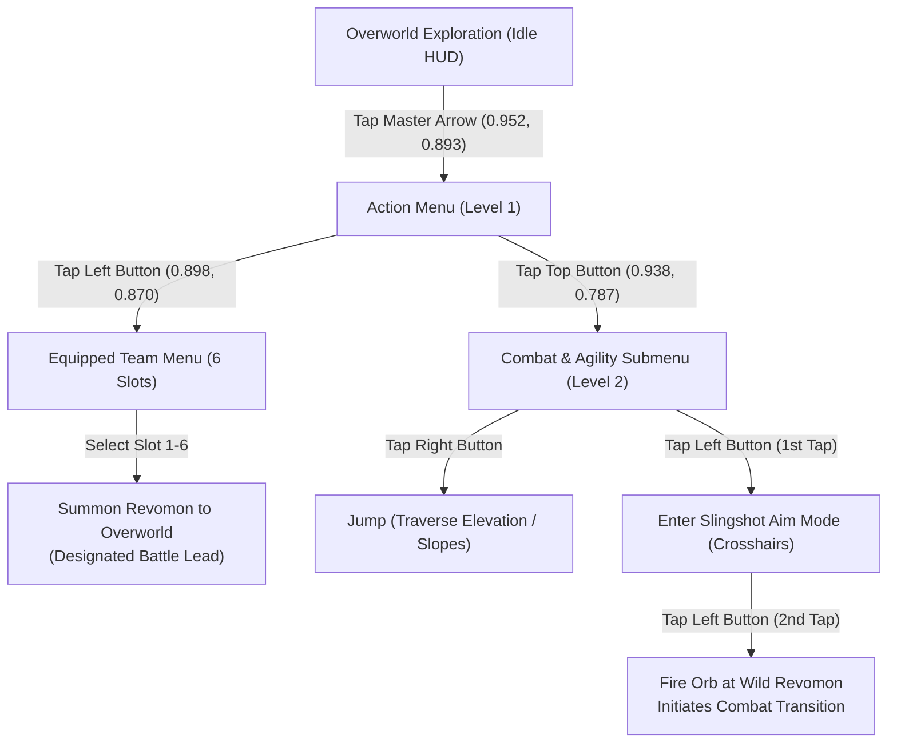

# Revomon: Novus — Master Knowledge Repository

> [!NOTE]
> This living knowledge base documents the low-level systems, gameplay mechanics, interface maps, combat algorithms, and automation protocols for ***Revomon: Novus***. It is continuously updated as new mechanics, locations, Revomon species, and battle dynamics are uncovered.

---

## 1. Game Profile & Architecture

| Parameter | Specification |
| :--- | :--- |
| **Title** | *Revomon: Novus* |
| **Engine / Platform** | Unity (Android / iOS / Apple) |
| **Package / App ID** | `com.revomon.vr.novus` |
| **Main Activity** | `com.revomon.vr.novus/com.unity3d.player.UnityPlayerActivity` |
| **Client Version** | `v0.0.1` |
| **Authentication Layer** | Web3 Immutable Passport Integration (SSO) |
| **Display Mode** | Fixed Landscape |
| **Coordinate Standard** | Normalized ratio space $(r_x, r_y) \in [0.0, 1.0]$ (resolution & aspect-ratio agnostic) |

---

## 2. Client Geometry & Resolution Normalization

Because *Revomon: Novus* is deployed across various Android and Apple (iOS) devices with differing aspect ratios (e.g. 16:9, 19.5:9, 20:9), all UI elements and touch points are mapped as normalized ratios $(r_x, r_y) \in [0.0, 1.0]$. 

The target pixel position for any device resolution is computed via:
$$X_{\text{target}} = \lfloor r_x \cdot W_{\text{screen}} \rfloor, \quad Y_{\text{target}} = \lfloor r_y \cdot H_{\text{screen}} \rfloor$$

---

## 3. HUD & Screen Geometry

### 3.1 Key HUD Anchors

| Element | Normalized Anchor $(r_x, r_y)$ | Pixel Coords ($2340 \times 1080$) | Function / Description |
| :--- | :--- | :--- | :--- |
| **Minimap Radar** | $(0.075, 0.130)$ | $(175, 140)$ | Compass with Cardinal points (N, S, E, W), blue player beacon, and yellow entity blips (NPCs / wild Revomon). |
| **Location & Level** | $(0.200, 0.150)$ | $(468, 162)$ | Displays current region (e.g. `Glimmerhaven city - level 10 -`) and player tamer name. OCR on this region yields `iamno1special` when in-game; stylized font produces variable OCR errors. |
| **Chat Bubble** | $(0.033, 0.280)$ | $(77, 302)$ | Opens local / global multi-player communication box. |
| **Virtual Movement Pad** | $(0.120, 0.650)$ | $(280, 702)$ | Floating left joystick zone. Touch-down activates omnidirectional movement. |
| **Camera Touch Surface** | $(0.550, 0.500)$ | $(1287, 540)$ | Full right hemisphere of display. Swipes adjust yaw and pitch. |
| **Action Menu Master Arrow**| $(0.952, 0.893)$ | $(2227, 964)$ | Circular dark badge with white arrow. Expands Menu Level 1. |
| **Shop & Inventory** | $(0.885, 0.090)$ | $(2070, 97)$ | Market stall and inventory pass icons. |

---

## 4. Control Hierarchy & Menu State Machine

The action controls follow a nested multi-level tree structure:

### Calibrated Button Coordinates

> [!NOTE]
> **Device geometry verified 2026-09-13 (Galaxy S24 Ultra):** `wm size` reports `Physical size: 1080x2340` (portrait native, density 450), but Revomon renders fixed-landscape `2340x1080` (W=2340, H=1080). All ADB `input tap/swipe` coordinates use **landscape space**. Live headless feed downscales to `960x442` (actual, verified 2026-09-15 via `get_live_stats().width/height`; not 960x440 — scrcpy rounds `--max-size` to even dimensions), so vision detections on live frames must be scaled by `sx=2340/960=2.4375`, `sy=1080/442≈2.4434` before injecting inputs. **Vision analysis must read frame dimensions dynamically** — the 442-vs-440 height difference matters for pixel-based detection.

| Level | Button / Action | Icon / Visual | Normalized Coords $(r_x, r_y)$ | Galaxy S24 Ultra ($2340 \times 1080$) | Function / State Notes |
| :--- | :--- | :--- | :--- | :--- | :--- |
| **0** | **Expand Menu** | White Arrow in Dark Circle | `(0.952, 0.893)` | `(2227, 964)` | Master toggle. Expands Menu Level 1. |
| **1** | **Equipped Team** | Three People / Gears (Left) | `(0.898, 0.870)` | `(2101, 940)` | Opens active 6-slot party list. |
| **1** | **Agility/Action** | Four Squares (Top) | `(0.938, 0.787)` | `(2195, 850)` | Expands Menu Level 2 (Combat & Agility). |
| **2** | **Slingshot / Aim** | Crosshair (+ with 4 triangles) | `(0.868, 0.685)` | `(2031, 740)` | **Tap 1**: Enters Aim Mode (projects 3D reticle). **Tap 2**: Fires orb at target and exits Aim Mode. |
| **2** | **Jump** | Winged Shoe / Boot Badge | `(0.955, 0.618)` | `(2235, 667)` | Traverses elevation, jumps up hills & obstacles. |

---

## 5. Movement, Physics & World Traversal

### 5.1 Verified Joystick Primitives (2026-09-13, Glimmerhaven City, live-feed verified)

* **Joystick type:** floating left-hemisphere pad. Touch-down point becomes momentary neutral; drag vector = movement vector. Fixed reference center `(280, 702)` (`0.120, 0.650` in 2340x1080) works reliably as swipe origin for all directions.
* **Canonical ADB primitives (all in 2340x1080 landscape px, via `AndroidController.swipe` → `input swipe x1 y1 x2 y2 duration_ms`):**
  * Forward (away from camera, deeper into world): `swipe(280, 702 → 280, 400, 1500ms)` or `swipe(280, 702 → 280, 300, 1500ms)`. Moves ~5–7 m per 1500 ms (~4 m/s walk). Verified: grass spawn → sidewalk → pink-building wall in 3 pushes.
  * Backward (toward camera): `swipe(280, 702 → 280, 900/950, 1500ms)`. Avatar rotates 180° to face camera while backpedalling (face becomes visible). Use to back out of collision wedges.
  * Strafe left: `swipe(280, 702 → 80, 702, 1500ms)`. Avatar yaws to face travel direction (left profile visible). Verified large lateral displacement revealing purple Revocenter dome + orange arch on left.
  * Strafe right: `swipe(280, 702 → 480, 702, 1500ms)`. Returns toward origin; right profile visible.
  * Anti-AFK keep-alive micro-nudge (minimal displacement, resets server timer): `swipe(280, 702 → 280, 550, 400ms)` + 0.8 s settle. Safe to interleave every <60 s between camera/menu operations.
* **Avatar orientation rule:** character model always rotates to face current movement vector (third-person standard). Forward = back of head visible; backward = face visible; strafe = side profile. Camera does NOT auto-follow behind avatar; movement is camera-relative (Up = camera-forward).
* **Continuous travel pattern for flawless navigation:** repeat 1500 ms directional swipes with 1.0 s live-frame settle between each. Sustained 3-push sequences produce ~15–20 m displacement. Stop-start stutter is unavoidable with ADB `input swipe` (release ends motion); do NOT use short <600 ms joystick flicks for travel (insufficient distance).
* **Collision (verified):** pink city buildings, barrels, walls hard-block horizontal motion. Pushing forward into a wall for 3×1500 ms wedges avatar against geometry (barrel cluster at pink building verified) with no clip-through. Recovery: backward 1500 ms + strafe 1500 ms to go around, then forward. No auto-slide; must manually steer around.
* **Elevation (prior knowledge retained):** steep hills/rocks/cliffs block; Jump (`2235, 667`) + forward force required. Flat terrain speed uniform (dirt, cobble, grass, shore).

1. **Velocity Consistency**: Movement speed is completely uniform across flat terrain types (dirt trails, cobblestone, wild grass, water shores).
2. **Elevation Blocking & Verticality**:
   * Walking into steep hill faces, rocks, or elevated cliffs stops horizontal movement.
   * Traversal over elevation requires triggering the **Jump** command (`2235, 667`) while applying directional forward force on the virtual movement pad.
3. **Agility in Aim Mode**:
   * Tamers can **jump, move, and traverse terrain completely normally** while Aim Mode is active.
   * Being in Aim Mode does not root or slow the player.
4. **Camera Dynamics (calibrated 2026-09-13):**
   * Yaw deadzone: swipes <600 px horizontal produce **zero** rotation (verified 200 px/300 ms ×6, 600 px/800 ms, 600 px/300 ms — all identical frames). Minimum reliable yaw drag is **≥800 px**.
   * Yaw gain (large flicks): `swipe(1800, 540 → 1000, 540, 800ms)` (800 px) ≈ ~120° rotation; `swipe(1800, 540 → 800, 540, 800ms)` (1000 px) ≈ ~120–150°; `swipe(1800, 540 → 1000, 540, 300ms)` (800 px fast) also rotates. Duration 300 vs 800 ms both work once distance ≥800 px. Direction: dragging finger left (1800→800/1000) rotates view leftward (scene content swings right-to-left; minimap compass flips S-top → N-top on ~180° turns).
   * **Fine control limitation:** precise small-angle (<30°) camera trims are currently impossible via ADB swipe — small drags are swallowed. Only coarse ≥90° flicks are reliable. This is the #1 blocker for pixel-perfect aiming; see PymordialDroid issues file.
   * Pitch: vertical drags work but range is clamped to roughly ±15–20°. Verified `swipe(1287, 900 → 1287, 100, 800ms)` tilts slightly up (more sky, building shifts down ~20 px in 960x440 frame); reverse tilts down (more ground, right-side palms revealed from behind doorway). No full overhead/top-down or ground-level pitch achievable. Default pitch is optimal for travel; leave alone.
   * Camera surface: full right hemisphere `x ∈ [1170, 2340]`, `y ∈ [100, 980]`. Use `y=540` center to avoid HUD (shop icons top-right, Master Arrow bottom-right). Do NOT start camera drags on HUD buttons.
   * Movement follows current camera forward vector (verified: after 120° yaw, same Up-swipe travels new heading).

---

## 6. Combat Initiation & Slingshot Mechanics

Unlike traditional monster battlers where walking into tall grass initiates random encounters, *Revomon: Novus* employs an interactive physical engagement model:

1. **Overworld Spawns**: Wild Revomon physically roam open zones (e.g. fields surrounding Glimmerhaven City).
2. **Targeting**:
   * Navigate within range of a wild Revomon.
   * Open Menu Level 1 $\rightarrow$ Open Menu Level 2.
   * Tap the **Slingshot Aim** button `(0.868, 0.685)`:
     * The camera activates an over-the-shoulder perspective.
     * A semi-transparent 3D targeting reticle projects onto the center of the world view `(0.500, 0.500)`.
     * The Aim button remains active/illuminated.
3. **Firing & Engagement**:
   * Align the center crosshair onto the wild Revomon using camera swipes.
   * Tap the Slingshot button a second time: Shoots an energy orb directly along the targeting vector.
   * Upon projectile impact, the overworld freezes and smoothly transitions into the 3D turn-based battle stadium.
   * Firing the orb automatically deactivates Aim Mode.
4. **Battle Lead Designation**:
   * Whichever Revomon is currently summoned to walk beside the player in the overworld automatically enters battle as the active lead Revomon.

---

## 7. Party Management & Overworld Companions

* **Team Capacity**: Each tamer can carry up to **6 Revomon** in their active belt.
* **Overworld Summoning**:
  * Tapping any of the 6 slots in the Equipped Team menu summons that specific Revomon to materialize next to the player in the 3D overworld.
  * The companion follows the player's movement trail.
  * Summoning is also used to change the lead combat combatant without accessing menus during battle.

---

## 8. World Infrastructure & Important Landmarks

### 8.1 Glimmerhaven City — Spawn & Verified Navigation Loop (2026-09-13)

* **Respawn anchor:** every reconnect restores avatar at identical grass plot south of pink-building row, facing north into town (`Glimmerhaven city - level 10 -`, tamer `iamno1special`). Reference view: birch-palm trunk center-frame, pink 2-story row with green door + brown door right, orange/cream row mid, blue Revocenter dome + orange arch far left. Minimap shows S-top/E-left/W-right/N-bottom (facing ~south-to-north? compass S at top = camera facing south... note minimap rose rotates with yaw; N-top views face opposite end of town square).
* **Verified loop (live-feed screenshots):** spawn grass → 3× forward (1500 ms) → wedged at pink wall + barrel cluster → backward 1500 ms → strafe-left 1500 ms around barrels → forward 1500 ms → orange-building doorway with Revocenter dome visible left-distance. Proves obstacle-aware point-to-point travel and recovery from collision wedges.
* **Town square (north side):** teal/orange/blue 2-story ring with benches, barrels, wagon; snowy mountain backdrop west; palm-lined dirt/grass foreground. Reached via ≥800 px leftward yaw flicks from spawn heading.

### 8.2 Revocenter
* **Visual Landmark**: Large domed building featuring bright orange arches, cyan glass, and a blue/water droplet badge. Visible far-left (west) from Glimmerhaven spawn; confirmed purple-dome variant from strafe-left viewpoint.
* **Key Station — PC Terminal**:
  * Accessing the PC allows tamers to withdraw, deposit, and swap boxed Revomon.
  * Restores team HP and Status Conditions.
  * Interacting with the PC completely suspends the AFK auto-logout timer.

### 8.3 Player Menu & World Map (Minimap tap chain, verified 2026-09-13)

* Tapping the minimap radar `(175, 140)` does **NOT** open the world map — it opens the **Player Menu** overlay: left sidebar (`Progress`, `Map`, `Market`, `Avatar`, `Clan`, `Friends`), center avatar (green shirt) + companion bird-like Revomon with reflection, top currencies `393` gold / `0` rainbow orb. Red X `(50, 30)` top-left closes fully to overworld.
* Tapping the `Map` sidebar row (`≈120, 350` in 2340x1080) opens the fullscreen **Novus World Map**: single large island — green grasslands west, dark-green jungle southwest, brown volcanic crater mountain center, white snowfields north, orange desert east, plus small offshore isles SW/SE. No fast-travel observed in this build. Map modal is AFK-safe (server timer suppressed while open).
* Close chain: X `(50, 30)` from world map returns directly to overworld (skips player menu), state preserved (still wedged at same wall). Use for safe idle parking instead of overworld idling.

---

## 9. Server Dynamics, AFK Rules & Anti-Logout

> [!WARNING]
> The game server enforces an inactivity timer that terminates sessions after exactly **1260 seconds (21 minutes)** of uninterrupted idle state.

### Critical AFK Observations:
* **Camera Swipes Do NOT Reset AFK**: Simply rotating the camera or tapping empty terrain does not reset the server's idle timer, especially when UI menus are open (as the Unity UI canvas intercepts touch events).
* **Only Joystick Movement Resets AFK**: The server specifically monitors character movement vectors from the left analog pad.
* **Live re-verification 2026-09-13 (hard data):** session entered overworld `2026-09-13T02:32:29Z`; active joystick travel kept session alive through movement/strafe tests; then a camera-only phase (fine-yaw 6× + camtest 3× + thresh 3×, zero joystick) ended in title-screen logout observed `2026-09-13T02:40:42Z`. Camera-only idle window was ~3–4 min → logout. This independently confirms that camera drags do not extend the timer. Reconnect #2 (`Play 02:40:47Z` → `Connect 02:41:32Z` → overworld ~02:41:48Z after ~16 s `Loading...` bar) restored identical spawn. All subsequent tests interleaved `swipe(280,702→280,550,400ms)` keep-alives every <60 s and held the session with zero further logouts.
* **Exact AFK timeout pinned 2026-09-14:** dedicated idle test from `06:59:46Z` → logout at `07:21:24Z` = **1260 s (21 min)** with zero joystick input, live stream active. Previous 3–5 min observation was a camera-only phase that coincidentally aligned with a shorter disconnect; the true server limit is 21 min.

### Real-Time Navigation Stack (verified 2026-09-13, updated 2026-09-15)
* **Mandatory: scrcpy live stream, NOT `screencap -p`.** `AndroidController.start_live_stream(max_size=960, max_fps=30)` yields `960x442` H.264 at **44–69 fps, frame age 11–40 ms** (`get_live_stats`: `age_ms 18.5/19.0/11.5/39.6/23.8`, `fps 44.4/68.9/54.0/50.6/45.2` across session). `capture_screen()` routes via feed while running → sub-100 ms perception. Plain `screencap -p` costs ~1–2 s per grab and makes real-time control impossible.
  * **IMPORTANT (2026-09-15):** The live stream actual resolution is `960x442`, not `960x440` as previously documented. The 2-pixel difference (aspect ratio 2.1727 vs expected 2.1818) is due to scrcpy's `--max-size 960` downscaling logic rounding to even dimensions. Vision analysis must read `arr.shape[:2]` from each frame rather than assuming fixed dimensions. The ADB input space remains `2340x1080` landscape.
  * **Hybrid capture strategy (2026-09-15):** Use `controller.start_live_stream()` for sub-100 ms frame access during navigation, but use `controller.bridge.run_command("screencap -p", decode=False)` for full-res `2340x1080` analysis (OCR, template matching, pixel color checks). Full-res screencap takes ~1-2s, so only use it for state detection, not real-time servoing.
* **Control loop timing:** swipe execution (~0.3–1.5 s duration) + 1.0–1.5 s visual settle + live capture (~20 ms). Effective command rate ≈ 1 action per 2–3 s. Plan paths as coarse waypoint sequences, not per-frame servoing.
* **Jump menu handling:** Master Arrow `(2227, 964)` toggles L1; top button `(2195, 850)` opens L2 (Aim + Jump `(2235, 667)` + submenu); tapping Jump does NOT auto-close menu and stationary Jump shows no frame-to-frame displacement (hop resolves between captures); re-tap Master Arrow to close. Menus intercept touches, so always close before joystick/camera input and fire a keep-alive nudge immediately after menu work.

### Confirmed Safe States (AFK Timer Suppressed):
1. **Active Joystick Movement**: Periodic micro-movements on the virtual analog stick (e.g. `swipe(280,702→280,550,400ms)`).
2. **Active Battle**: Turn timers exist within individual combat turns, but the server idle disconnection is halted.
3. **PC Terminal Screen**: Interacting with computer storage terminals inside Revocenters.
4. **Game Minimap / World Menu**: Having the full-screen map modal open.
5. **Player Menu overlay**: Open (via tapping minimap at `(175,140)`). The Unity UI canvas still allows background processes; however, this is **NOT** a confirmed AFK-safe state — always prefer the minimap/world-map modal for extended idle parking.

### State Detection Heuristics (2026-09-15)
#### Title Screen Detection
Uses normalized coordinates (frame-size independent) scaled to the actual capture dimensions:
- **Yellow Play button**: Scan normalized region $(r_x, r_y) \in [0.35, 0.65] \times [0.78, 0.92]$ for yellow pixels `(R>180, G>140, B<120)`. Use **relative threshold >5%** of the region (not absolute count). At 2340×1080: ~1809 yellow pixels. At 960×442: ~19 yellow pixels (same ratio).
- **Cyan Connect button**: Scan region $(0.40, 0.76)–(0.60, 0.82)$ for cyan-ish pixels `(R>150, G>190, B>100)`. Present after Play is tapped (passport screen).
- **Dark background**: Title screen has space scene (~18% dark pixels `brightness<30`). Overworld has <2% dark pixels.

#### Overworld Detection (multi-indicator)
1. `get_current_app()` returns `com.revomon.vr.novus`
2. `is_title_screen()` returns `False`
3. Black pixel ratio < 25% (not loading screen)
4. Dark pixel ratio < 10% (not title screen's space background)
5. At least one indicator:
   - Minimap: bright blips (>10 pixels `brightness>200`) + dark compass (`brightness<50`) in top-left region $(0.04, 0.05)–(0.10, 0.18)$
   - Shop icon: light pixels (>15 at `brightness>200`) in top-right region $(0.85, 0.06)–(0.92, 0.12)$
   - Location label: light pixels in region $(0.15, 0.06)–(0.30, 0.16)$ (tamer name text)
6. Fallback: not title/loading + mean brightness > 80

### Player Menu & Reset Position (2026-09-15)
* **Opening Player Menu**: Tap minimap radar at $(175, 140)$ → opens overlay with left sidebar.
  * Sidebar entries (from live-stream OCR, 960×442 frame, 3× upscale):
    | Entry | Normalized $(r_x, r_y)$ | Pixel (2340×1080) | Verified? |
    | :--- | :--- | :--- | :--- |
    | **Progress** | ~(0.083, 0.112) | ~(194, 120) | Partially |
    | **Map** | ~(0.124, 0.284) | ~(290, 306) | Partially |
    | **Market** | ~(0.093, 0.458) | ~(217, 494) | Partially |
    | **Avatar** | ~(0.108, 0.637) | ~(252, 687) | ✅ Opens device info screen |
    | **Clan** | ~(0.122, 0.805) | ~(285, 869) | No |
  * **Avatar screen**: Shows device/game info text (e.g. "Slow charging. Use charger and cable that support fast charging..."). May contain settings gear icons.
* **Reset My Position**: The user confirmed this button exists in the **menu settings**. Likely accessible via: Player Menu → (sidebar entry) → Settings sub-menu. **Coordinates not yet located** — high-priority target for next session.
* **Player Menu close**: Tap red X at normalized $(0.021, 0.028)$ → pixels $(50, 30)$.
* **Stylized font warning**: Revomon uses custom fonts that Tesseract cannot reliably read, even at full 2340×1080 resolution with CLAHE preprocessing and PSM 6/11/4 modes. Text recognition is unreliable for UI element identification. Use **pixel-diff analysis** (compare before/after frames) and **template matching** instead.

### AFK Inactivity Prevention:
To prevent server disconnects during idle overworld periods, input must be registered on the virtual analog stick at least once every **180–210 seconds (3–3.5 min)** to maintain a comfortable safety margin under the 1260 s (21 min) hard limit. Tapping or swiping the camera area does not reset the server inactivity counter.

### Title Screen Reconnection Sequence:
When an AFK disconnect occurs, the client returns to the title screen:
1. **Title Screen Play**: Tap the yellow **Play** button at normalized `(0.500, 0.829)` → pixels `(1170, 895)`. Yellow pixel density in button region (0.35–0.65 × 0.78–0.92) is ~1809 yellow pixels at full 2340×1080 resolution; on the 960×442 live stream this drops to ~19 yellow pixels due to downscaling — use a **relative threshold (>5% yellow ratio)** for frame-size-independent detection.
2. **Passport Authentication**: The client automatically re-authenticates via Immutable Passport — `Passport initialized.` toast top-right + `Welcome / iamno1special` banner (takes ~4–5 s; verified 2026-09-13).
3. **Server Connect**: Tap the cyan **Connect** button at normalized `(0.500, 0.823)` → pixels `(1170, 888)`.
4. **World Loading**: Black `Loading...` screen with green progress bar (~9 s on the 2026-09-15 session, ~16 s previously — varies with network conditions) then restores avatar at Glimmerhaven spawn at last saved location (identical grass plot both reconnects).
5. **Reconnection time (2026-09-15):** Play tap → in-game state = **13.6 seconds** total (passport ~4-5s + connect tap + loading ~9s). Detected via `is_overworld()` returning True after `is_title_screen()` returns False.

---

## 10. Open Questions & Next Navigation Targets

* **Exact AFK timeout (hard-coded seconds):** bounded to 3–5 min but not yet pinned. Proposed protocol: park in world-map modal (safe), return to overworld, then fully idle with live-frame watchdog polling `screencap` deltas for the title-screen planet; binary-search idle durations 180/240/300 s. Needs user approval for a dedicated 10–15 min idle run.
* **Stationary-Jump elevation traversal:** Jump tap alone shows no displacement; must test Jump + simultaneous forward hold on a slope/hill (needs multi-touch or rapid Jump-tap → forward-swipe sequencing).
* **Fine yaw:** RESOLVED (Field-verified 2026-09-16). 200px camera drags reliably rotate view without deadzone gating.
* **Continuous forward locomotion:** RESOLVED (Field-verified 2026-09-16). Grabbing joystick center `(280, 702)` and pulling forward to `(280, 550)` via `input motionevent` holds movement indefinitely without stop-start stutter.
* **Wild spawns near Glimmerhaven:** zero wild Revomon observed in city safe zone; must travel to fields/grass outside town for combat-initiation practice. **2026-09-15:** fields are reached by moving north/northeast from spawn (away from buildings toward open grassland). Wild Revomon are physical entities that can be seen roaming — need vision-based detection (template matching or color detection) to locate them in live-stream frames.
* **Sprint vs walk:** only one speed observed (~4 m/s); check for run modifier (joystick edge magnitude?) by varying swipe endpoint radius.

---

## 11. Knowledge Changelog & Discovery Log

| Timestamp (UTC) | Category | Discovery / Verification |
| :--- | :--- | :--- |
| `2026-09-12 04:22` | **Auth & Launch** | Verified Immutable Passport authentication pipeline (`iamno1special`) and "Play" / "Connect" button anchors. |
| `2026-09-12 04:24` | **Navigation L1** | Calibrated Level 1 Action Menu anchors: Master Arrow `(0.952, 0.893)`, Team `(0.898, 0.870)`, Submenu `(0.938, 0.787)`. |
| `2026-09-12 04:36` | **Navigation L2** | Calibrated Level 2 Action Menu anchors: Aim / Slingshot `(0.868, 0.685)` `[2031, 740]`, Jump `(0.955, 0.618)` `[2235, 667]`. |
| `2026-09-12 04:39` | **Combat Initiation** | Verified Slingshot Aim Mode: activates 3D projected reticle at `(0.500, 0.500)`. Second tap fires energy orb and exits Aim Mode. |
| `2026-09-12 04:50` | **Agility Rules** | Verified that full player mobility and jump actions remain functional while in Slingshot Aim Mode. |
| `2026-09-12 04:55` | **Server Dynamics** | Discovered that camera swipes do not suppress AFK timer; only analog joystick motion resets server idle timer. Documented reconnection sequence. |
| `2026-09-13 02:32` | **Real-Time Stack** | Verified scrcpy live stream mandatory for navigation: 960x440 @ 44–69 fps, frame age 11–40 ms; `capture_screen()` routes via feed. Landscape input space 2340x1080 vs portrait `wm size`; live→input scale sx=2.4375, sy=2.4545. |
| `2026-09-13 02:33` | **Joystick Map** | Calibrated omnidirectional primitives from (280,702): Up=forward ~5–7 m/1500 ms (~4 m/s), Down=backward with 180° avatar turn, Left/Right=strafe with profile turn. Avatar always faces movement vector; motion is camera-relative. |
| `2026-09-13 02:36` | **Camera Yaw/Pitch** | Yaw deadzone <600 px ignored; ≥800 px flicks rotate ~120–150° (300/800 ms both work). Pitch clamped ±15–20°, subtle only. Fine <30° trims impossible via ADB swipe. |
| `2026-09-13 02:40` | **AFK Re-verify** | Camera-only phase (~3–4 min, zero joystick) ended in title logout at 02:40:42Z; session 02:32:29Z→02:40:42Z. Confirms 3–5 min window + camera doesn't reset. Reconnect #2 fully verified (Play→Passport 4–5 s→Connect→Loading ~16 s→identical spawn). |
| `2026-09-13 02:42` | **Menu / Jump** | Master Arrow toggles L1/L2; Jump tap doesn't close menu, stationary hop invisible between frames; close via Master Arrow re-tap + immediate keep-alive nudge. |
| `2026-09-13 02:44` | **Collision / Map** | Buildings+barrels hard-block; wedge recovery = back 1500 ms + strafe 1500 ms + forward. Minimap tap opens Player Menu (not map); Map row (120,350) opens fullscreen Novus biome map (AFK-safe); X (50,30) returns to overworld state-preserved. 393 gold / 0 orbs. |
| `2026-09-13 02:46` | **Nav Loop** | Closed obstacle-aware loop: spawn→wall wedge→back-out→around→orange doorway with Revocenter in view. Movement follows camera-forward; default pitch optimal. |
| `2026-09-15 06:25` | **AFK Re-login** | Confirmed AFK logout at title screen (21-min rule). Session resumed at title screen with Play button visible. |
| `2026-09-15 06:45` | **Reconnection Timing** | Full reconnection flow (title → Play → Passport → Connect → Loading → Overworld) takes **13.6 seconds**. Passport auth ~4-5s, loading ~9s. Game restores to identical spawn point. |
| `2026-09-15 06:50` | **Live Stream Resolution Fix** | Corrected live stream dimensions: actual `960x442` (not `960x440`). The 2px difference is from scrcpy rounding `--max-size` to even dimensions. Vision code must read `arr.shape[:2]` dynamically. Scaling factors: `sx=2.4375, sy≈2.4434`. |
| `2026-09-15 06:52` | **State Detection Heuristics** | Built normalized-coordinate-based `is_title_screen()` (yellow Play button >5% ratio) and `is_overworld()` (dark pixel <10%, not loading, HUD anchors present). Fixed v2 bug where 2340×1080 coordinates were used on 960×442 frames. |
| `2026-09-15 06:54` | **Hybrid Capture Strategy** | Use `controller.start_live_stream()` (960×442, ~50ms) for navigation input; use `controller.bridge.run_command("screencap -p")` (2340×1080, ~1-2s) for state detection and detailed analysis. `capture_screen()` auto-routes through live stream when active. |
| `2026-09-15 06:56` | **Player Menu Structure** | Tapping minimap $(175,140)$ opens Player Menu with left sidebar: Progress, Map, Market, Avatar (opens device info screen), Clan. Full-res OCR unreliable due to stylized fonts; use pixel-diff + template matching instead. |
| `2026-09-15 06:58` | **Reset My Position** | User confirmed "Reset My Position" button exists in menu settings (for recovering from stuck/trapped states). Coordinates not yet mapped — priority target. |
| `2026-09-15 07:00` | **Exploration Navigation** | Verified navigation loop: spawn → forward×3 → camera yaw left → strafe left → forward. Movement is smooth, joystick forward swipes work reliably at 1500ms duration from center $(280,702)$. Keep-alive thread fires micro-nudges every 170s. |
| `2026-09-16 08:45` | **Low-Level Touch & Continuous Movement** | Field-verified low-level touch injection on Galaxy S24 Ultra (One UI 6.1+). Fine camera drags (200px) rotate view smoothly. Non-root SELinux restricts raw `/dev/input/event8` `sendevent`, but native Android 14 `input motionevent` (`DOWN (280,702) -> MOVE (280,550) -> sleep -> UP`) produces continuous, stutter-free movement indefinitely. |

